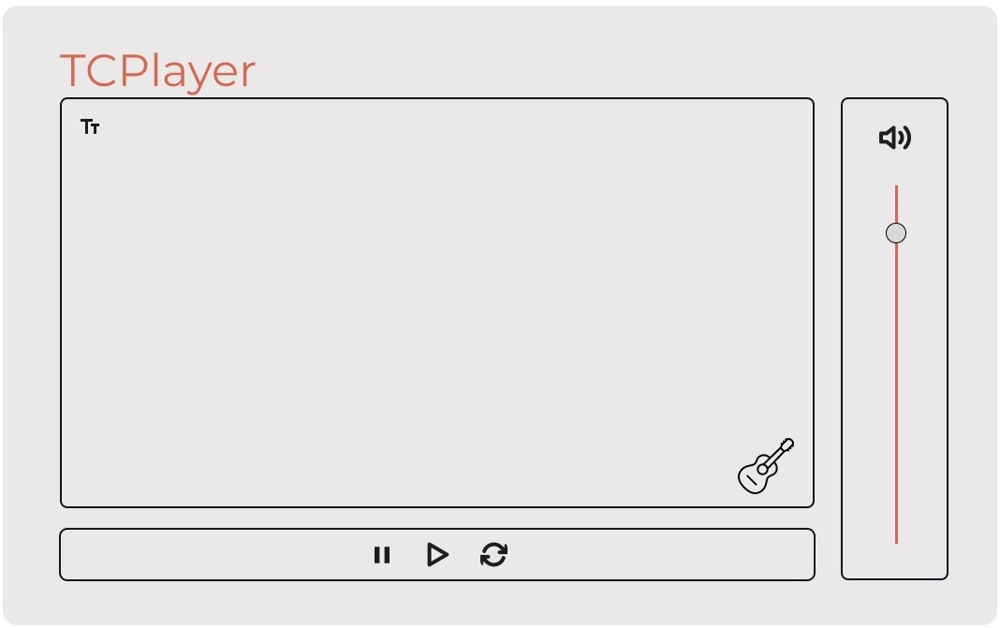

# MIDIPlayer

This project aims to create a MIDI player application using Object Oriented program construction techniques, aimed at practicing the implementation of modular software.

> Initial idea

## Development map

The project is still in development phase, the next updates will be focused on the following topics:

### Logic
- [ ] Midi Events
- [ ] Midi Loader
- [ ] Midi Player

### UI
- [ ] App UI
- [ ] UI Controls
- [ ] Event Handler

### Controllers (Logic x UI interface)
- [ ] Midi Controller
- [ ] State Manager

### Tests
- [ ] Midi App
- [ ] UI Controls
- [ ] Midi Controller
- [ ] Midi Loader
- [ ] Midi Player

## Team
- [José](https://github.com/dev-joseh)
- [Marcelo](https://github.com/marcelobasso)
- Gisele
- Isadora